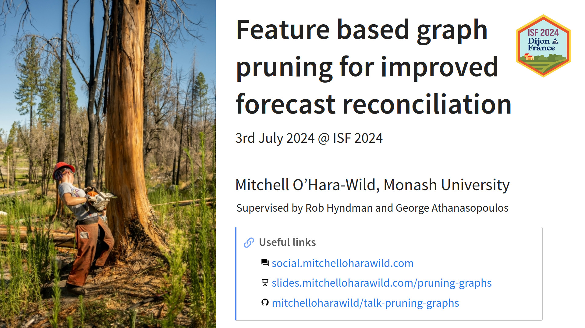

<!-- README.md is generated from README.qmd. Please edit that file -->

# ISF2024: Feature based graph pruning for improved forecast reconciliation

<!-- badges: start -->
<!-- badges: end -->

Slides and notes for a talk at the 44th International Symposium on
Forecasting (30th June - 3rd July 2024) in Dijon, France.

A recording of this presentation is available on YouTube here:
<https://www.youtube.com/watch?v=gLeoYWdQROg>

#### Abstract

Large collections of related time series often use attributes that
identify their relation to other series. These attributes typically
relate to what is being measured, such as product categories or store
locations for the sales of a product over time. Aggregating across these
attributes produces additional time series that offer useful overviews
of the data. Forecast reconciliation uses these aggregations to improve
forecasting accuracy. When there exists many attributes for time series
data, the number of series in the collection quickly grows. This
presents many problems for forecasting, since producing many forecasts
can be computationally infeasible and the forecast accuracy for
aggregated series of interest can worsen.

To overcome these problems I propose using time series features to
identify noisy, uninformative, or otherwise unwanted series and
leveraging graph representations of aggregation constraints to safely
remove them while preserving coherency structures. In this talk I will
introduce pruning coherency constraints using graphs and demonstrate how
graph search algorithms can be used to efficiently identify and remove
uninformative subgraphs of time series while maintaining coherency.
Pruning subgraphs of time series from the collection can substantially
reduce the number of series to forecast, while retaining most of the
information. This helps limit the computational complexity of
forecasting, while improving forecast accuracy for aggregated series due
to reduced model misspecification in more disaggregated series.

#### Structure

- Recap of graph reconciliation
- The curse of dimensionality in reconciliation, large scale and
  inaccurate (?)
- Feature-based pruning of coherency constraints for improved
  computational complexity and forecasting accuracy
- Application and evaluation on real example

Revised structure:

> Background and problem

- What is forecast reconciliation (already covered by earlier talks)
- Introduction to the fpp3 pageviews data
- The problem with forecast reconciliation
- Accuracy table of incoherent vs coherent forecasts
- Augment accuracy table by various depths

> Accuracy and pruning (can forecast many, but should?)

- Explore why this happens (model misspecification?)
- Visually traverse the graph of fpp3 pageviews pointing out interesting
  patterns (weekly, annual seasonality - exam time in Australia)
- At sparse time series, introduce the solution - discard the subgraph

> Opportunity / possibility (can’t forecast many, but shouldn’t!)

- Using more dimensions of disaggregation (the ‘clickbait’)
- Accuracy table?

> Future work

- Better measures of ‘forecast-ability’
- Lumping unwanted series together
- Graph vocab for specifying which time series to keep
- Finish implementation and software design

### Format

17 minute talk with 3 minutes for questions.
